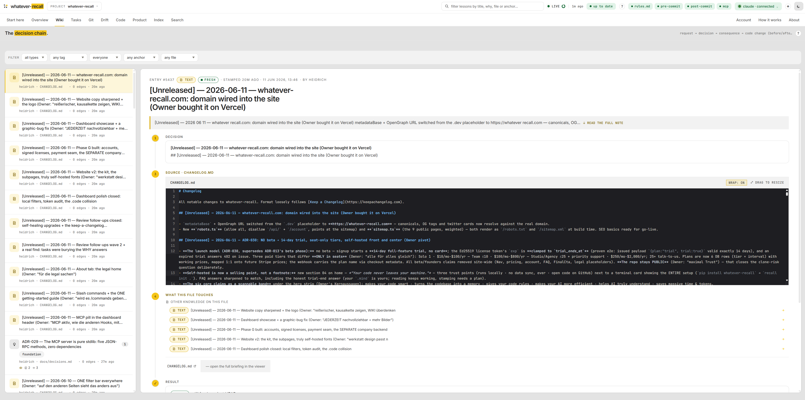
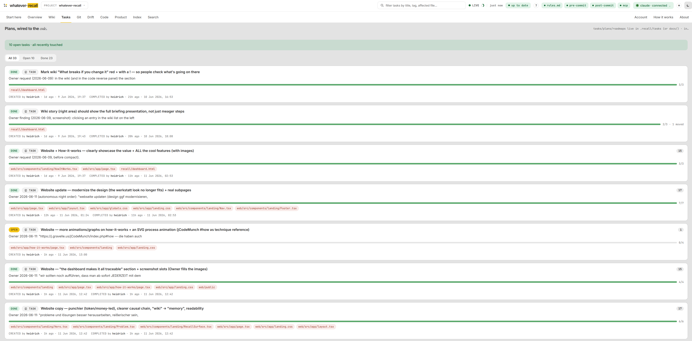
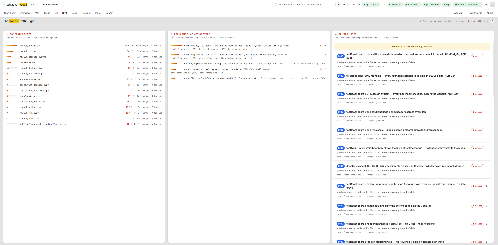
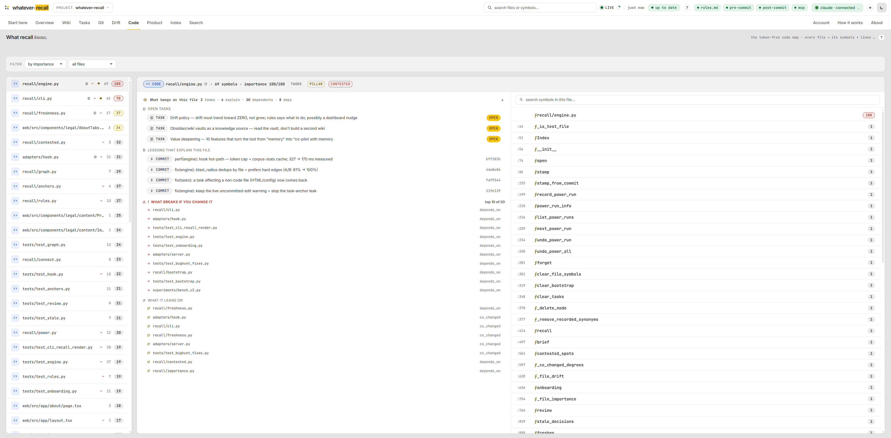
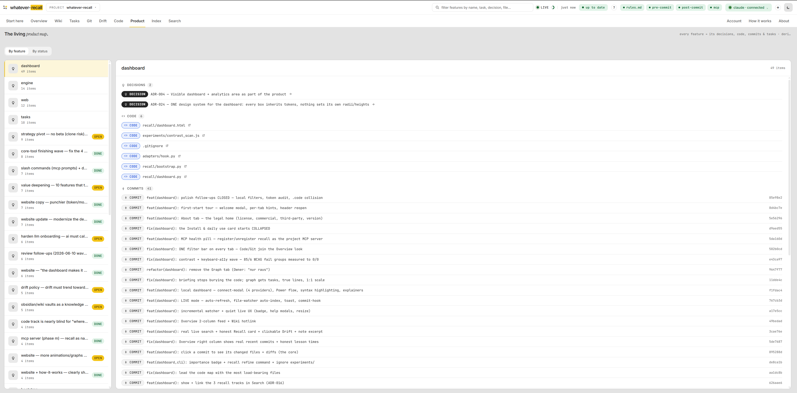

# whatever-recall

**AI-native project memory. Move the intelligence from read-time to write-time.**

Stop paying your AI to re-read the same files. Every *"why is this here?"* makes it grep and re-read whole files — **~214,000 tokens for just three questions** on a real production repo.

recall makes the codebase itself smart **at write-time** — while the AI is already in there fixing the bug and still *knows why*. It stamps that knowledge (the decision, the why, the anchors) directly onto the git commit.

Reading it back is dead-simple, instant and free: plain SQLite full-text search. **The same three answers cost 152 tokens, arrive in ~2 ms, and every one is traceable to the commit it was written against.** No model calls. No embeddings. No API costs.

**[whatever-recall.com](https://whatever-recall.com)** · [How it works](https://whatever-recall.com/how-it-works) · [Pricing](https://whatever-recall.com/pricing) — every plan has every feature, scaled only by seats; 14-day full trial, no card.

Part of the `whatever` family: [whatever-cms](https://whatever-cms.app) · whatever360 · **whatever-recall**.

---

## The paradigm shift: write-time vs. read-time

> **Move the intelligence from the guessing moment (read-time — expensive, vague) to the knowing moment (write-time — cheap, exact).**

- **The old way (read-time): expensive & vague.** The AI guesses. Every prompt forces grep-and-read, a local embedding model or cloud RAG over your repo — and the cost grows with the codebase.
- **The recall way (write-time): cheap & exact.** While the AI works and already understands — fixing the bug, making the call — it *stamps* the knowledge onto the commit: the decision, the why, the **anchors** (the technical terms it concerns). Costs almost nothing; the context is already in its head. The reader is a **dead-dumb, token-free lookup** (SQLite FTS5, zero model calls) — the intelligence lives in the index, not in the reader.

**Why this wins:** a dumb lookup stays flat and free while grep-and-read grows with every file you add — so the harder the question and the bigger the repo, the wider the gap. No local embedding model needed: that was only ever required *because* the reader had to guess.

## Measured, not claimed

Cold-start on two live production repos (a 240-commit app with 43,722 anchors · a 668-commit CMS with 108,627 anchors), three real architectural questions, no recall trailers planted:

| metric | grep-and-read | whatever-recall | the gap |
|---|---|---|---|
| tokens for the same three answers | ~214,000 | **152** | **~1,400× fewer** |
| time to the answer | ~147 ms | **~2.18 ms** | **~67× faster** |
| latency at 108,627 anchors | grows with the repo | **0.25 ms median** | stays flat |
| model tokens at read-time | every prompt pays | **0** | no model, no embeddings, no API key |

The methodology ships with this repo — run it yourself: `python experiments/bench_v2.py` (source-verified ground truth, exact file+symbol judging). A CI quality gate (`--gate`) enforces retrieval floors on every change.

## See it

The local dashboard, running on this repository's own memory:











More in [docs/screenshots/](docs/screenshots/) — including [dark mode](docs/screenshots/dark-mode.png), the [pre-edit briefing](docs/screenshots/pre-edit-briefing.png) and the [first-start tour](docs/screenshots/start-here.png).

## How it works (for devs who want to verify the trust)

Five steps; four of them are **structurally model-free** (0 tokens, offline — a guard test breaks the build if an import ever changes that, ADR-014):

1. **Bootstrap** — tree-sitter turns your code into one node per function/class (docstring included), git history becomes commit nodes, CHANGELOG/ADRs/docs become lesson nodes. Pure stdlib, runs offline, token-free — a working memory in under a second.
2. **Recall** (the read path) — a question is tokenized into anchors and matched against the index (SQLite FTS, BM25); back come three tracks: the **code** (where), the **knowledge** (why), and the **blast radius** (what breaks). Sub-millisecond. **Zero tokens.**
3. **Pre-edit briefing** (ADR-018) — ask recall about *one file* (`recall brief <file>`) and it bundles, read-only: the open **tasks** on that file (standing intent), the **why**, what **breaks** if you change it, and what it **depends on**. An AI never accidentally undoes a deliberate decision it has never seen. The team view — *which* files are uncertainty hotspots — is `recall contested` (churn × entanglement, ADR-019).
4. **Drift** — every pinned node is checked by SHA against the working tree: 🟢 fresh · 🟡 file moved · 🟠 file gone. The index cannot rot silently, because the code is the single source of truth. recall offers to heal stale notes; you approve, it re-stamps.
5. **Power Mode** (opt-in, *your* AI, ADR-008/012) — only if you deliberately connect a model does it enrich the hottest files with the "why" the code alone can't give. Every power node is tagged to its run and fully reversible (`recall undo`).

**What you can audit:** the read path never calls a model · by default nothing leaves your machine · the dashboard is loopback-only with a DNS-rebinding guard, no CDN, no telemetry (even syntax highlighting is vendored).

### Transparent governance — `rules.md`

recall is governed by **one** human-readable file: [`recall/rules.md`](recall/rules.md). It defines the silence floor, the closed tag vocabulary, the facet weights, and what stays quiet. An AI that connects to recall installs exactly this file — which is why it sits openly in the repo and is viewable + downloadable in the dashboard (`GET /api/rules`). No invisible black box: you audit the rules that govern your memory.

## Quickstart

```bash
git clone https://github.com/heidrich/whatever-recall.git
cd whatever-recall
pip install -e ".[codemap]"        # tree-sitter code map; a plain PyPI install ships with launch

cd /path/to/your-project
recall init .                      # token-free bootstrap -> .mind/index.db
recall "rls cutover workspace_id"  # the 3 tracks, sub-ms, 0 tokens
recall "..." --for-prompt          # a copyable context block for any web AI
recall brief src/lib/api.ts        # pre-edit briefing: tasks / why / what breaks
recall contested                   # uncertainty hotspots: churn × entanglement
recall dashboard                   # the wiki, on localhost
```

The full step-by-step guide is **[recall/getting-started.md](recall/getting-started.md)** — the same file the dashboard serves under "How it works" and [whatever-recall.com/install](https://whatever-recall.com/install) renders.

### Four doors to the same engine

- **CLI** (`recall/cli.py`) — in the terminal.
- **MCP** (`recall/mcp.py`, ADR-029) — recall as native tools in Claude Code / Cursor / any MCP client, pure stdlib (no extra package):

  ```bash
  claude mcp add recall -- recall mcp    # that is the ENTIRE install
  recall mcp --print-config              # snippets for .mcp.json / Cursor
  ```

  Tools: `recall` · `brief` · `explain` · `stamp` · `contested` · `freshen`. A checked-in `.mcp.json` registers the server automatically for everyone who clones the repo.
- **IDE hook** (`adapters/hook.py`) — Claude Code: stamps on commit, briefs before the edit.
- **HTTP bridge** (`adapters/server.py`, extra `[bridge]`) — `POST /recall` for web AIs without an IDE; Bearer-token gate.

The read path is pure stdlib (sqlite3 + FTS5) — 0 tokens, 0 model, offline. `tree-sitter` (code map) and the bridge are optional extras; the base install has **zero runtime dependencies**.

## Power Mode (optional) — bootstrap quality GOOD → EXCELLENT

The token-free base is already strong. Power Mode lets **your** AI read the hotspots **once** and stamp the real "why" in plain language + synonyms + typed edges — recalled token-free a million times after. **By default NOTHING is connected** (ADR-012): you connect an AI deliberately, locally (free) or online (costs money).

```bash
recall connect --provider ollama --model llama3   # local, free, offline
# or: recall connect --provider anthropic --model claude-opus-4-8   (key stays in $ANTHROPIC_API_KEY)

recall power                # shows the token/cost estimate and STOPS
recall power --yes          # runs only after the accepted estimate
recall power --dry-run      # full preview, index untouched
recall undo --power-run 1   # surgically reverses run 1
recall undo --all           # back to the pure bootstrap base
```

Two gates protect you: **connect** decides WHICH AI, the **estimate + `--yes`** decides WHETHER this run happens. No token ever flows silently — the estimate is computed with **0 completion calls**.

## Why it is defensible

Three things a foundation lab structurally won't ship, because they run against its lock-in interest:

1. **Ownership** — the graph lives in *your* repo, belongs to you, and travels with every agent (Claude / Cursor / GPT / Gemini).
2. **Prose governance** — you steer your memory with five sentences of `rules.md` instead of being at the mercy of an invisible lab black box.
3. **SHA freshness** — a code reference in a note automatically degrades to "was true at SHA xy" the moment the code moves — without a model ever reading the code. Cursor/RAG can't do this in principle: their edges have no identity and no time.

The recall mechanism itself is deliberately trivial. The value is the accumulated graph + the open standard it lives in. **Standard beats feature.**

## Self-hosted. Nothing leaves your machine.

recall is a small CLI plus one local SQLite file (`.mind/index.db`) inside your repo. No cloud, no data sync, no telemetry — it only reads your project, on your machine. The website only checks your license. This repository is public on purpose: read every line that touches your repo before you run it.

## Status

The engine — stamping, 3-level recall, drift/heal, bootstrap, dashboard, MCP, Power Mode — is built, dogfooded on itself and on live production repos, and guarded by **431 tests plus retrieval-quality gates in CI**. Accounts, the 14-day trial and signed offline license tokens are live at [whatever-recall.com](https://whatever-recall.com); CLI-side license enforcement ships next. What changes per release: [recall/changelog.md](recall/changelog.md) — the same notes the dashboard's Changelog tab and [whatever-recall.com/changelog](https://whatever-recall.com/changelog) show.

## License

**[Business Source License 1.1](LICENSE)** — source-available, with a real open-source promise.

- **Noncommercial = free:** hobby, study, research, teaching, nonprofit organizations — read, use, modify, share, at no cost. Development, testing and evaluation (incl. the 14-day trial) are free too.
- **Commercial production use = subscription:** one seat per person — [COMMERCIAL.md](COMMERCIAL.md) · [whatever-recall.com/pricing](https://whatever-recall.com/pricing). Solo $10/mo · Team (up to 10) $100/mo · Studio (up to 25) $250/mo — every plan has every feature.
- **The 3-year promise:** every released version automatically becomes **Apache 2.0** three years after its release — your stack can never end up in a proprietary dead end.
- **Not licensed, ever:** using recall to offer a competing product or service.

Your *memory* (the graph in `.mind/`) remains yours and travels with every agent — the license protects the **engine**, not your data.

whatever-recall is a product & service of [McCain Digital](https://mccain-digital.com). All official email comes from **@mccain-digital.com** — support: [support@mccain-digital.com](mailto:support@mccain-digital.com) · billing & refunds: [payment@mccain-digital.com](mailto:payment@mccain-digital.com).

© 2026 [McCain Digital](https://mccain-digital.com) · Bavaria, Germany
